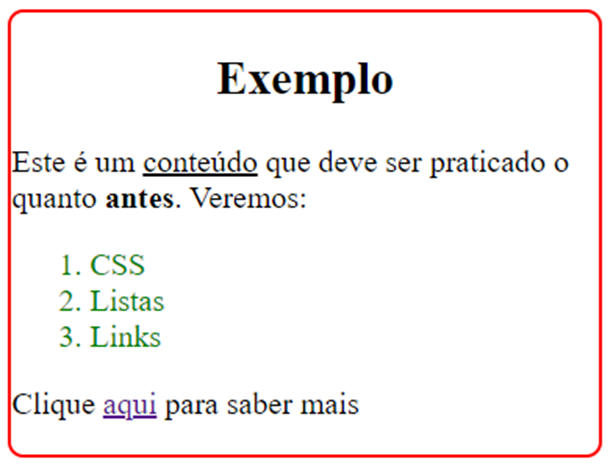

    

# Teste de Performance 2

## Exercício 15

Recrie o layout abaixo. A tag div deve possuir 300px de largura e o link que está em “aqui” na frase “Clique aqui para saber mais” está redirecionando para o site da infnet (https://www.infnet.edu.br/infnet/instituto/) em outra aba.

    

